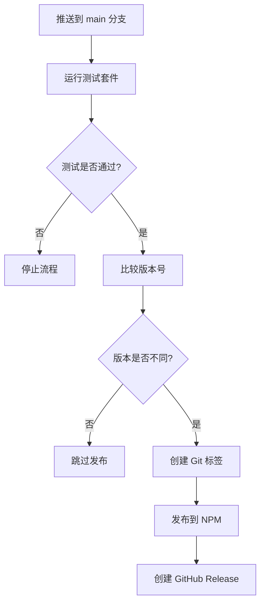

# 🤖 简化自动发布系统

本项目实现了简单高效的自动发布流程，基于版本号比较自动发布到 NPM。

## 🚀 工作原理

### 简单版本检测

系统只做一件事：**比较 package.json 中的版本与 NPM 上已发布的版本**

- ✅ **版本不一致** → 自动发布新版本
- ❌ **版本一致** → 跳过发布

### 版本管理方式

**手动更新版本号**：
```bash
# 你需要手动更新版本
npm version patch   # 1.0.0 → 1.0.1
npm version minor   # 1.0.0 → 1.1.0  
npm version major   # 1.0.0 → 2.0.0
```

## 📋 自动化流程

### 触发条件

✅ **自动发布**：
- 推送到 `main` 分支
- 所有测试通过
- package.json 版本与 NPM 版本不一致

❌ **跳过发布**：
- 测试失败
- package.json 版本与 NPM 版本一致

### 简化流程



## 🛠️ 配置要求

### 必需的 GitHub Secrets

在仓库设置中添加以下 secrets：

```
NPM_TOKEN=npm_xxxxxxxxxxxxxxxxxxxxxxxxxxxxxxxx
```

### 获取 NPM Token

1. **网页方式**（推荐）：
   - 访问 https://www.npmjs.com/settings/tokens
   - 点击 "Generate New Token" → "Classic Token"
   - 选择 "Automation" 类型
   - 复制生成的 token

2. **命令行方式**：
   ```bash
   npm login
   npm token create --access=public
   ```

## 📝 版本更新流程

简单的三步发布流程：

### 1️⃣ 手动更新版本号
```bash
# 根据你的更改类型选择合适的版本更新
npm version patch   # 修复 bug: 1.0.0 → 1.0.1
npm version minor   # 新功能: 1.0.0 → 1.1.0
npm version major   # 破坏性更改: 1.0.0 → 2.0.0
```

### 2️⃣ 提交并推送
```bash
git add .
git commit -m "你的提交信息"  # 提交信息可以随意写
git push origin main
```

### 3️⃣ 自动发布
- GitHub Actions 自动检测版本变化
- 运行所有测试
- 发布到 NPM
- 创建 GitHub Release

## 🎯 使用示例

### 场景 1：修复 Bug

```bash
# 1. 修复代码后，更新版本
npm version patch  # 1.2.3 → 1.2.4

# 2. 提交并推送
git add .
git commit -m "fix: resolve markdown parsing issue"
git push origin main

# 3. 自动结果：
# ✅ 检测到版本变化 1.2.3 → 1.2.4
# ✅ 发布到 NPM
# ✅ 创建 GitHub Release
```

### 场景 2：添加新功能

```bash
# 1. 开发新功能后，更新版本
npm version minor  # 1.2.4 → 1.3.0

# 2. 提交并推送
git add .
git commit -m "feat: add support for custom containers"
git push origin main

# 3. 自动结果：
# ✅ 检测到版本变化 1.2.4 → 1.3.0
# ✅ 发布到 NPM
# ✅ 创建 GitHub Release
```

### 场景 3：破坏性更改

```bash
# 1. 重大更改后，更新版本
npm version major  # 1.3.0 → 2.0.0

# 2. 提交并推送
git add .
git commit -m "breaking: redesign plugin configuration API"
git push origin main

# 3. 自动结果：
# ✅ 检测到版本变化 1.3.0 → 2.0.0
# ✅ 发布到 NPM
# ✅ 创建 GitHub Release
```

## 🔍 监控和调试

### 查看自动化状态

1. **GitHub Actions**：
   - 访问仓库的 "Actions" 标签
   - 查看最新的 "CI/CD Pipeline" 运行状态

2. **版本历史**：
   - 查看 `package.json` 中的版本号
   - 检查 Git 标签：`git tag -l`
   - 查看 NPM 发布历史

### 常见问题排查

#### ❌ NPM 发布失败

**可能原因**：
- NPM_TOKEN 过期或无效
- 网络连接问题
- 包名冲突

**解决方案**：
```bash
# 检查 token 有效性
npm whoami --registry https://registry.npmjs.org/

# 重新生成 token
npm token create --access=public
```

#### ❌ 版本检测错误

**可能原因**：
- Git 历史不完整
- 标签信息缺失

**解决方案**：
```bash
# 手动创建初始标签
git tag v1.0.0
git push origin v1.0.0
```

#### ❌ 权限问题

**可能原因**：
- GitHub token 权限不足
- 分支保护规则冲突

**解决方案**：
- 确保 GITHUB_TOKEN 有写入权限
- 检查分支保护设置

## 🔧 高级配置

### 自定义版本规则

可以修改 `.github/workflows/ci.yml` 中的版本检测逻辑：

```bash
# 添加更多关键词
if echo "$COMMIT_MESSAGES" | grep -i "breaking\|major\|BREAKING" > /dev/null; then
  VERSION_TYPE="major"
elif echo "$COMMIT_MESSAGES" | grep -i "feat\|feature\|minor\|add" > /dev/null; then
  VERSION_TYPE="minor"
fi
```

### 条件发布

```yaml
# 只在特定条件下发布
- name: Publish to npm
  if: |
    steps.version-check.outputs.should-publish == 'true' &&
    !contains(github.event.head_commit.message, '[no-publish]')
```

## 📊 效果展示

启用自动化版本管理后，你的开发流程将变成：

1. **开发** → 写代码
2. **提交** → `git commit -m "feat: new feature"`
3. **推送** → `git push origin main`
4. **等待** → GitHub Actions 自动处理一切
5. **完成** → 新版本已发布到 NPM 🎉

**无需手动**：
- ❌ 更新版本号
- ❌ 创建 Git 标签
- ❌ 发布到 NPM
- ❌ 创建 Release

**全自动化**：
- ✅ 智能版本检测
- ✅ 自动测试验证
- ✅ 自动发布流程
- ✅ 完整的发布记录

现在你可以专注于代码开发，让 CI/CD 处理所有的发布工作！🚀