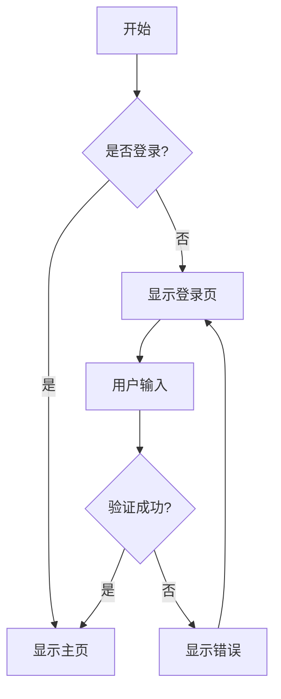
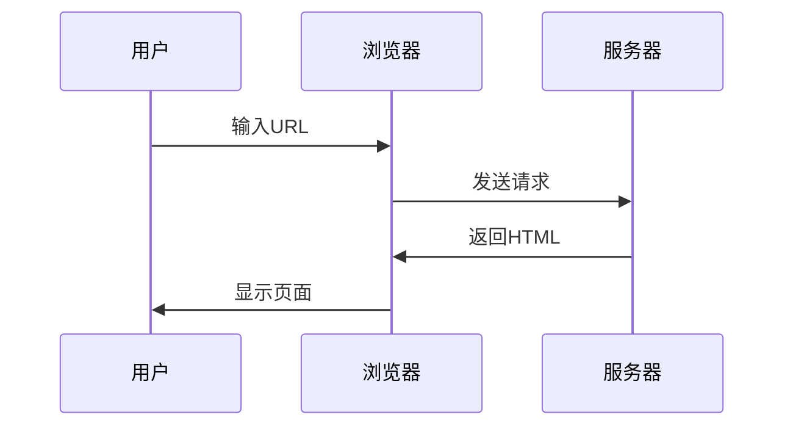

# Markdown Renderer Multi - 完整功能测试文档

这个文档包含了 `markdown-renderer-xirizhi` 支持的所有 Markdown 格式，用于测试渲染器的完整功能。

## 基础 Markdown 语法

### 标题

# 一级标题
## 二级标题
### 三级标题
#### 四级标题
##### 五级标题
###### 六级标题

### 文本格式

**粗体文本**
*斜体文本*
***粗斜体文本***
~~删除线~~
++插入文本++
==高亮文本==

### 上标和下标

- 化学公式：H~2~O
- 数学公式：x^2^ + y^2^ = z^2^
- 日期：29^th^ of February

### 链接和图片

[普通链接](https://example.com)
[带标题的链接](https://example.com "这是标题")


### 列表

#### 无序列表
- 项目 1
- 项目 2
  - 子项目 2.1
  - 子项目 2.2
- 项目 3

#### 有序列表
1. 第一项
2. 第二项
   1. 子项目 2.1
   2. 子项目 2.2
3. 第三项

#### 任务列表
- [x] 已完成的任务
- [ ] 待完成的任务
- [x] 另一个已完成的任务
- [ ] 另一个待完成的任务

### 引用

> 这是一个引用块
> 
> 可以包含多行内容
> 
> > 这是嵌套引用

### 代码

#### 行内代码
这是 `行内代码` 示例。

#### 代码块

```
普通代码块
没有语法高亮
```

```javascript
// JavaScript 代码高亮
function hello() {
    console.log('Hello World!');
    return 'success';
}

// 数组操作
const numbers = [1, 2, 3, 4, 5];
const doubled = numbers.map(n => n * 2);
console.log(doubled);
```

```python
# Python 代码高亮
def fibonacci(n):
    if n <= 1:
        return n
    return fibonacci(n-1) + fibonacci(n-2)

# 列表推导式
squares = [x**2 for x in range(10)]
print(squares)
```

```css
/* CSS 代码高亮 */
.container {
    display: flex;
    justify-content: center;
    align-items: center;
    background-color: #f0f0f0;
}

.button {
    padding: 10px 20px;
    border: none;
    border-radius: 5px;
    background-color: #007bff;
    color: white;
}
```

```bash
# Shell 命令
npm install markdown-renderer-xirizhi
node example.js
git add .
git commit -m "Add new features"
```

### 表格

#### 基础表格
| 姓名 | 年龄 | 城市 |
|------|------|------|
| 张三 | 25   | 北京 |
| 李四 | 30   | 上海 |
| 王五 | 28   | 广州 |

#### 对齐表格
| 左对齐 | 居中对齐 | 右对齐 |
|:-------|:--------:|-------:|
| 内容1  |   内容2  |  内容3 |
| 长内容 |   短内容 |    内容|

#### 多行表格
| 功能 | 描述 | 状态 |
|------|------|------|
| 基础渲染 | 支持标准 Markdown 语法 | ✅ 完成 |
| 插件系统 | 支持 23+ 插件扩展 | ✅ 完成 |
| 数学公式 | KaTeX 数学公式渲染 | ✅ 完成 |

### 分隔线

---

***

___

## 高级功能

### 数学公式 (KaTeX)

#### 行内数学
这是行内数学公式：$E = mc^2$，爱因斯坦质能方程。

#### 块级数学
$$
\sum_{i=1}^{n} x_i = x_1 + x_2 + \cdots + x_n
$$

$$
\int_{-\infty}^{\infty} e^{-x^2} dx = \sqrt{\pi}
$$

$$
\begin{pmatrix}
a & b \\
c & d
\end{pmatrix}
\begin{pmatrix}
x \\
y
\end{pmatrix}
=
\begin{pmatrix}
ax + by \\
cx + dy
\end{pmatrix}
$$

### 表情符号 (Emoji)

:smile: :heart: :thumbsup: :fire: :rocket: :star:
:wave: :clap: :tada: :100: :ok_hand: :muscle:
:earth_americas: :sun_with_face: :moon: :rainbow: :snowflake:
:coffee: :pizza: :hamburger: :cake: :apple: :banana:

### 脚注

这是一个包含脚注的文本[^1]。这里还有另一个脚注[^note]。

[^1]: 这是第一个脚注的内容。
[^note]: 这是一个命名脚注，可以包含更详细的说明。

### 缩写

*[HTML]: HyperText Markup Language
*[CSS]: Cascading Style Sheets
*[JS]: JavaScript

这个文档使用了 HTML、CSS 和 JS 技术。

### 定义列表

Apple
:   红色或绿色的水果
:   计算机公司

Orange
:   橙色的柑橘类水果

### 属性扩展

这是一个带有属性的段落{.custom-class #my-id data-value="test"}

[链接](https://example.com){.external target="_blank"}

### 容器

### 链接网格

::: json
blackType: links
site: 哔哩哔哩
owner: 哔哩哔哩
url: `https://www.bilibili.com/`
desc: 中国最大二次元网址
image: `https://gcore.jsdelivr.net/gh/guicaiyue/FigureBed@master/MImg/20240101223710179.jpg`
color: "#6AC1EC"
blackType: links
site: Earthworm
owner: cuixueshe
url: `https://earthworm.cuixueshe.com/`
desc: PC端英语学习打字网站,适合英语基础较差的人学习
image: `https://earthworm.cuixueshe.com/logo.png`
color: "#e7693f"
extinfo: 学习记录
exturl: `https://xirizhi.cn/docs/learn-english/earthworm/study-record`
:::


::: warning 警告
这是一个警告容器的内容。
:::

::: info 信息
这是一个信息容器的内容。
:::

::: success 提示
这是一个成功容器的内容。
:::

::: danger 危险
这是一个危险容器的内容。
:::

### 日语注音 (Furigana)

{東京^とうきょう}は{日本^にほん}の{首都^しゅと}です。
{可愛い犬^か+わい・い・いぬ}が{公園^こうえん}で{遊んで^あそんで}います。

### 剧透标签

!!这是一个剧透内容，点击查看!!

!!《复仇者联盟》中钢铁侠最后牺牲了自己!!

### 图表 (Charts)

```chart
{
  "type": "bar",
  "data": {
    "labels": ["一月", "二月", "三月", "四月", "五月"],
    "datasets": [{
      "label": "销售额",
      "data": [12, 19, 3, 5, 2]
    }]
  }
}
```

### Mermaid 图表






### 目录 (TOC)

[[toc]]

### 括号跨度

这是一个[带有类名的跨度]{.highlight}。

### 插入和标记

这是++插入的文本++和==标记的文本==。

### 中文排版优化

这是中文text混排的example，pangu.js会自动在中英文之间添加空格。

## 测试用例

### 复杂嵌套

> 这是一个引用
> 
> ```javascript
> // 引用中的代码
> function test() {
>     return "Hello World";
> }
> ```
> 
> - 引用中的列表
> - 第二项
>   - 嵌套项目
> 
> | 表格 | 在引用中 |
> |------|----------|
> | 单元格1 | 单元格2 |

### 混合格式

**粗体中包含 `代码` 和 :smile: 表情**

*斜体中包含 [链接](https://example.com) 和 ==高亮==*

### 特殊字符测试

- HTML 实体：&lt; &gt; &amp; &quot; &#39;
- 特殊符号：© ® ™ § ¶ † ‡ • … ‰ ′ ″ ‴ ※
- 数学符号：± × ÷ ≠ ≤ ≥ ∞ ∑ ∏ ∫ √ ∂ ∆

### 长文本测试

Lorem ipsum dolor sit amet, consectetur adipiscing elit. Sed do eiusmod tempor incididunt ut labore et dolore magna aliqua. Ut enim ad minim veniam, quis nostrud exercitation ullamco laboris nisi ut aliquip ex ea commodo consequat. Duis aute irure dolor in reprehenderit in voluptate velit esse cillum dolore eu fugiat nulla pariatur. Excepteur sint occaecat cupidatat non proident, sunt in culpa qui officia deserunt mollit anim id est laborum.

---

## 结论

这个测试文档包含了 `markdown-renderer-xirizhi` 支持的所有主要功能：

1. ✅ 基础 Markdown 语法
2. ✅ 文本格式化（粗体、斜体、删除线等）
3. ✅ 上标和下标
4. ✅ 代码高亮
5. ✅ 表格（包括多行表格）
6. ✅ 数学公式 (KaTeX)
7. ✅ 表情符号
8. ✅ 脚注
9. ✅ 任务列表
10. ✅ 容器
11. ✅ 日语注音
12. ✅ 剧透标签
13. ✅ 图表支持
14. ✅ Mermaid 图表
15. ✅ Graphviz 图表
16. ✅ 中文排版优化
17. ✅ 属性扩展
18. ✅ 定义列表
19. ✅ 缩写
20. ✅ 目录生成

使用这个文档可以全面测试渲染器的各项功能是否正常工作。